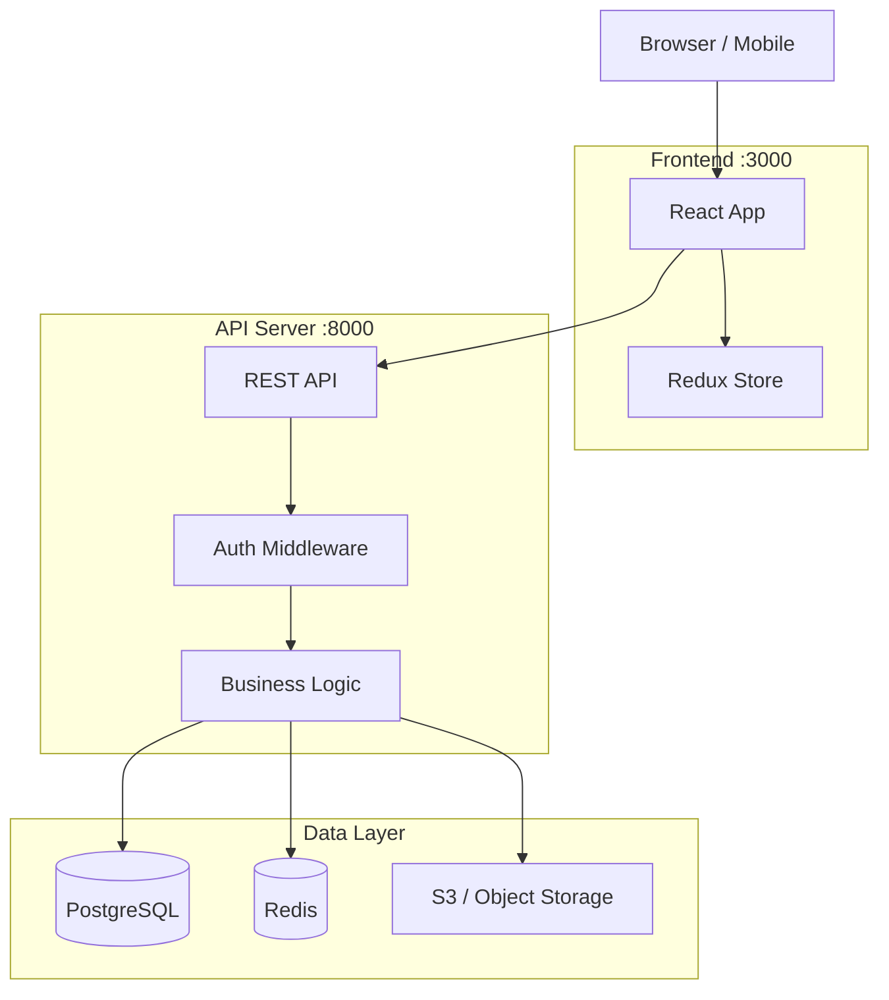
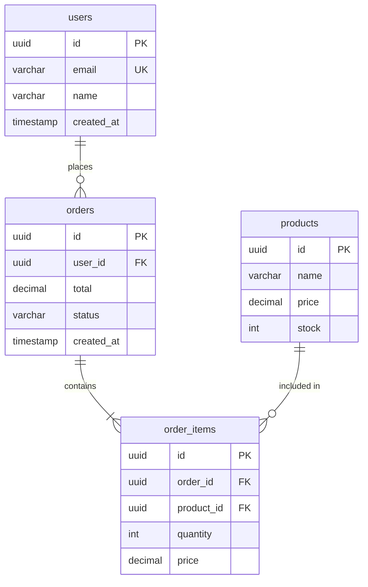
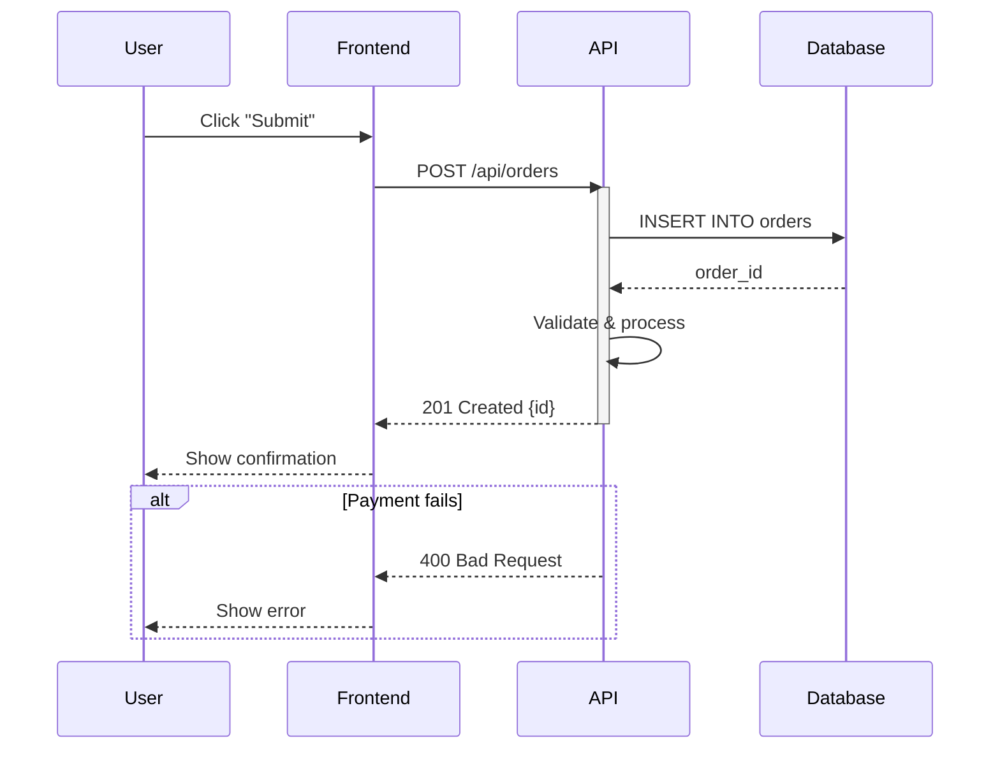
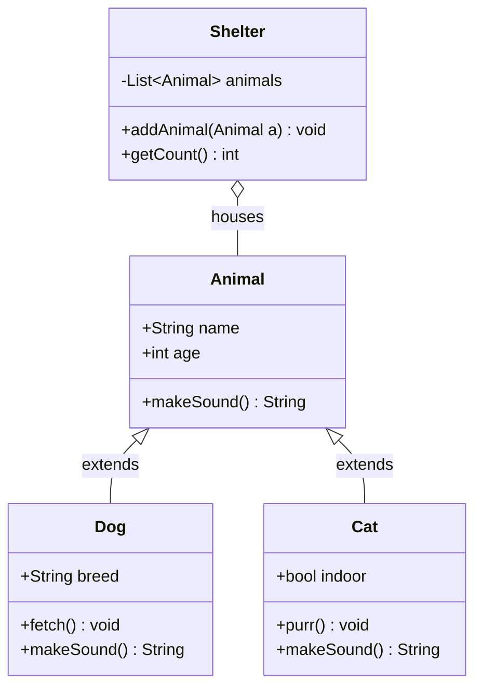
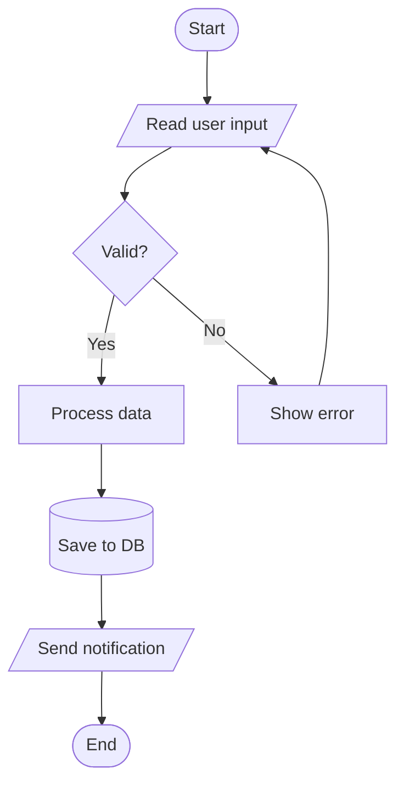
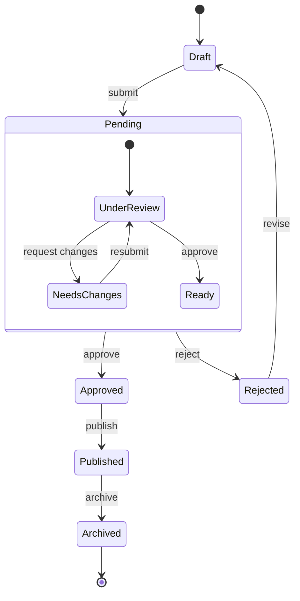
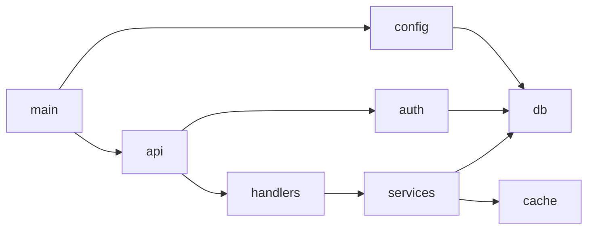
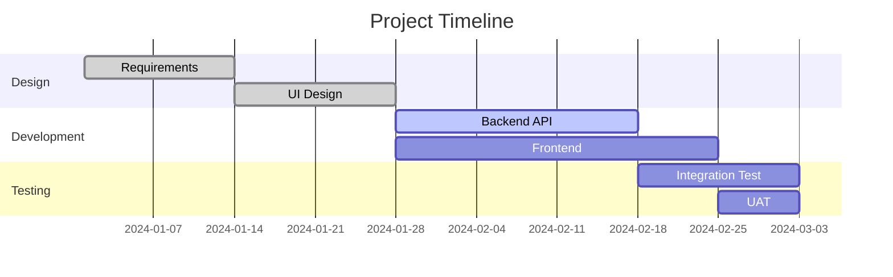

# Mermaid Diagram Patterns

## Table of Contents
- [Architecture Diagram](#architecture-diagram)
- [ER Diagram](#er-diagram)
- [Sequence Diagram](#sequence-diagram)
- [Class Diagram](#class-diagram)
- [Flowchart](#flowchart)
- [State Diagram](#state-diagram)
- [Dependency Graph](#dependency-graph)
- [Gantt Chart](#gantt-chart)
- [Styling Tips](#styling-tips)

## Architecture Diagram

Use `graph TD` (top-down) or `graph LR` (left-right) with `subgraph` for layers.



**Tips:**
- Use `[("...")]` for database cylinder shape
- Use `["..."]` for rectangles, `(["..."])` for rounded
- Group related components in `subgraph` with descriptive titles
- Add port numbers in subgraph titles for clarity

## ER Diagram



**Relationship symbols:**
- `||--||` one to one
- `||--o{` one to many
- `o{--o{` many to many
- `|` mandatory, `o` optional

**Tips:**
- Include PK/FK/UK annotations
- Use common SQL types: `uuid`, `varchar`, `int`, `decimal`, `timestamp`, `text`, `boolean`, `json`
- Quote relationship labels with spaces: `"included in"`

## Sequence Diagram



**Arrow types:**
- `->>` solid line with arrowhead (sync call)
- `-->>` dashed line with arrowhead (response)
- `--)` async message

**Tips:**
- Use `participant X as "Short Name"` for readability
- `activate`/`deactivate` to show lifeline
- `alt`/`else` for conditional branches
- `loop` for repeated operations
- `Note over A,B: text` for annotations

## Class Diagram



**Visibility:**
- `+` public, `-` private, `#` protected, `~` package

**Relationships:**
- `<|--` inheritance
- `*--` composition
- `o--` aggregation
- `-->` association
- `..>` dependency

## Flowchart



**Node shapes:**
- `[text]` rectangle
- `(text)` rounded
- `{text}` diamond (decision)
- `[(text)]` cylinder (database)
- `([text])` stadium (start/end)
- `[/text/]` parallelogram (I/O)

## State Diagram



## Dependency Graph

Use `graph LR` for module dependency visualization:



## Gantt Chart



## Styling Tips

### Theme
mmdc supports themes via config:
```json
{
  "theme": "default"
}
```
Available: `default`, `dark`, `forest`, `neutral`. Pass via `-c config.json` to mmdc.

### Large Diagrams
When a diagram exceeds ~20 nodes:
1. Split into multiple diagrams by domain/layer
2. Create an overview diagram linking to detail diagrams
3. Use `graph LR` (horizontal) for wide dependency trees
4. Use `graph TD` (vertical) for deep hierarchies

### Text in Labels
- Quote strings with special characters: `A["API (v2)"]`
- Use `<br/>` for line breaks in labels: `A["Line 1<br/>Line 2"]`
- Avoid `--` in labels (conflicts with Mermaid syntax)
